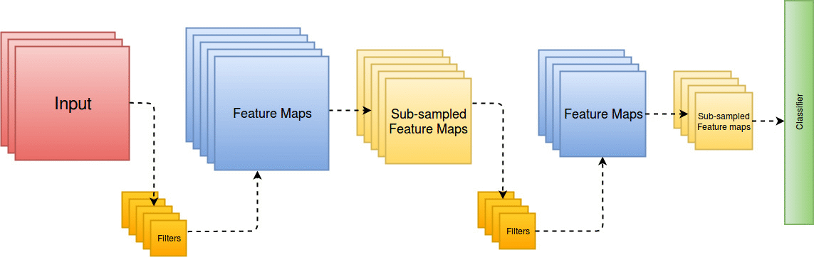
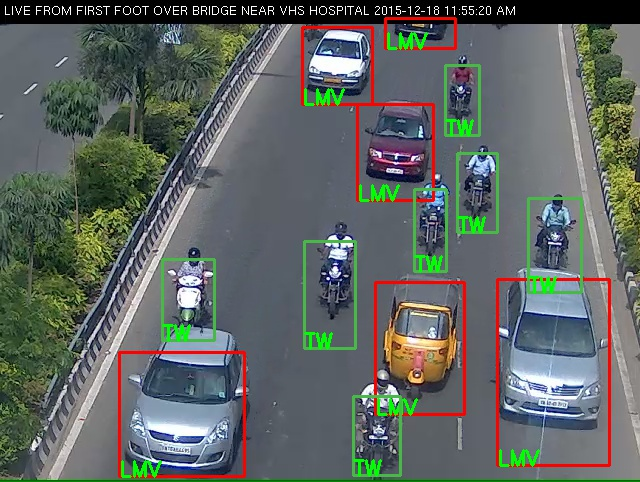

<head>
<title> 
Deepak Mittal
 </title>
</head>
# About Me

 I am currently pursuing my M.S. (Research) under Dr. Balaraman Ravindran and co-guided by Dr. Gitakrishnan Ramadurai at IIT Madras. I joined IIT Madras in Jan 2015. My area of research is Deep learning. Currently my work is focused on model compression and model pruning.

<a href="https://github.com/deepak242424/"> Github </a>
 
# Publications:

<table width="100%" align="center" border="0" cellspacing="0">
 <tr>
  <td width ="100%" colspan="2">
   <h3>Recovering from Random Pruning: On the Plasticity of Deep Convolutional Neural Networks</h3><h5><i><b> Submitted to IEEE Winter Conference on Applications of Computer Vision (WACV) 2018</b></i></h5>
   <h5> Deepak Mittal, Shweta Bhardwaj, Mitesh M Khapra, Balaraman Ravindran </h5>
    </td>
  
   </tr>
 <tr>
 <td width ="100%" colspan="2">
        
  </td>
 </tr>
 <tr>
 <td width ="100%" colspan="2">
        
 <h6> Recently there has been lot of work on pruning filters from deep convolutional neural networks (CNNs) with the intention of reducing computations. The key idea is to rank the filters based on a certain criterion (say, l1-norm, average percentage of zeros, etc) and retain only the top ranked filters. Once the low scoring filters are pruned away the remainder of the network is fine tuned and is shown to give performance comparable to the original unpruned network. In this work, we report experiments which suggest that the comparable performance of the pruned network is not due to the specific criterion chosen but due to the inherent plasticity of deep neural networks which allows them to recover from the loss of pruned filters once the rest of the filters are fine-tuned. Specifically, we show counter-intuitive results wherein by randomly pruning filters from deep CNNs we are able to obtain the same performance as obtained by using state of the art pruning methods. We empirically validate our claims by doing an exhaustive evaluation with two state of the art networks (VGG-16 and ResNet-50). Further, we also evaluate a real world scenario where a CNN trained on all 1000 ImageNet classes needs to be tested on only a small set of classes at test time (say, only animals). We create a new benchmark dataset from ImageNet to evaluate such class specific pruning and show that even here a random pruning strategy gives close to state of the art performance. Lastly, unlike existing approaches which mainly focus on the task of image classification, in this work we also report results on object detection. We show that using a simple random pruning strategy we can achieve significant speed up in object detection (74% improvement in fps) while retaining the same accuracy as that of the original Faster RCNN model.</h6>

  </td>
</tr>
        
        
   <tr>
  <td width ="100%" colspan="2">
   <h3>Training a Deep Learning Architecture for Vehicle Detection Using Limited Heterogeneous Traffic Data</h3><h5><i><b> Accepted at COMSNETS 2018 Workshop on Intelligent Transportation Systems</b></i></h5>
   <h5> Deepak Mittal, Avinash Reddy, Gitakrishnan Ramadurai, Kaushik Mitra, Balaraman Ravindran </h5>
    </td>
  
   </tr>
 <tr>
      <td width="30%">
               
      </td>
      <td valign="top" width="70%"> 
        
 <h6> Video image processing of traffic camera feeds is useful for counting and classifying vehicles, estimating queue length, traffic speed and also for tracking individual vehicles. Unlike homogeneous traffic, heterogeneous traffic includes multiple vehicle types that do not follow lane discipline. Vehicle detection is especially challenging when vehicles are occluded which is common in heterogeneous traffic. Recently \textit{Deep Learning} has shown remarkable promise in solving many computer vision tasks such as object recognition, detection, and tracking. However, training deep learning architectures require huge labeled datasets which are time-consuming and expensive to acquire. We circumvent this problem by data augmentation. By properly augmenting an existing large general (non-traffic) dataset with a small low-resolution heterogeneous traffic dataset (that we collected), we obtain state-of-the-art vehicle detection performance. To the best of our knowledge the collected dataset, named IITM-HeTra, is the first publicly available labeled dataset of heterogeneous traffic.</h6>

        </td></tr>
        
   </table>
   
# Work Experience
<ul>
<li> Intenrship at IBM Research Lab Bangalore from May 2015 to July 2015.</li>
<li> Worked in Safenet Infotech (now <a href="https://safenet.gemalto.com/"> Gemalto </a>) as an Associate Software Engineer from July 2013 to Jan 2015.</li>
<li> Internship at Safenet Infotech (now <a href="https://safenet.gemalto.com/"> Gemalto </a>) from Jan 2013 to June 2013.</li>
</ul>

# Academic Details
I have completed my B.Tech from The Technological Institute of Technology and Sciences, Bhiwani in Computer Science and Engineering in 2013.

# Contact:
deepak [at] cse [dot] iitm [dot] ac [dot] in

